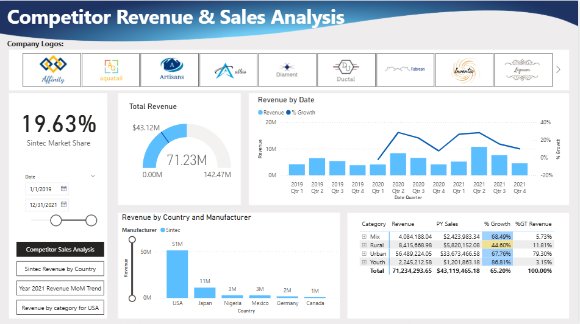
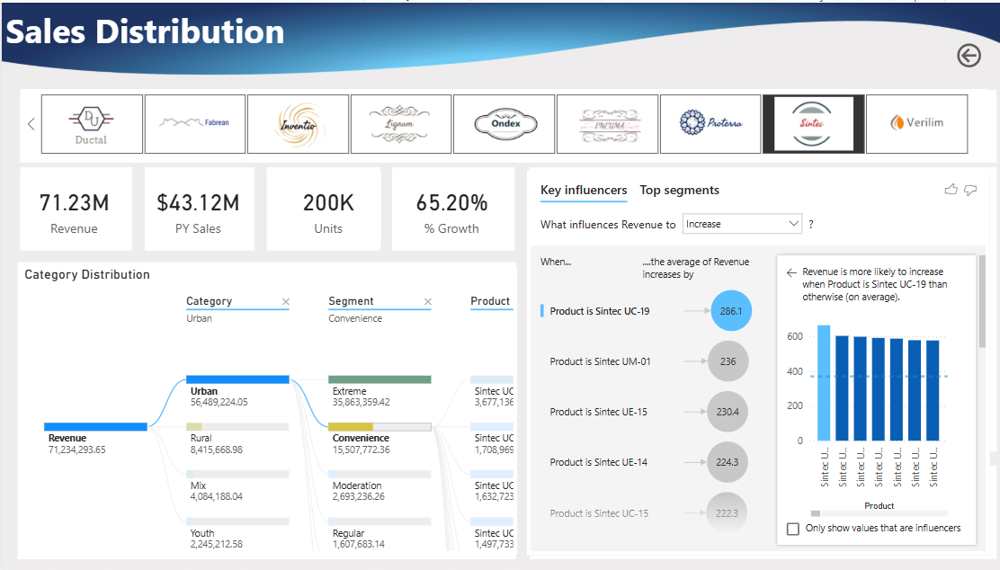
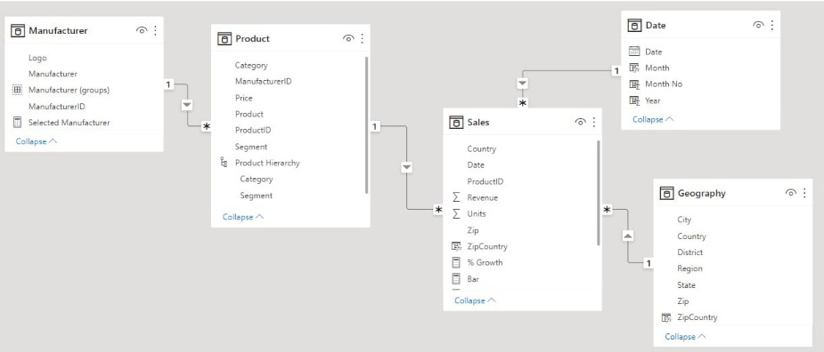

# 📊 Competitor Revenue & Sales Analysis - Power BI

[]()
[]()
[]()
[]()
[]()
[]()
[]()


---

## 📌 Project Intent

This project takes a deep dive into **Sintec's** commercial performance and benchmarks it against 13 competitors across 6 countries using 3 years of transactional sales data (2019–2021).

The goal is to answer two layers of questions:

**Internal:** How is Sintec performing — which categories, segments, and products drive revenue, and how fast is it growing?

**Competitive:** Where does Sintec lead, where is it losing ground, and who are the real rivals to watch?

> Dataset spans **14 unique manufacturers**, **2,400+ unique products**, across **4 categories**, **6 countries**, analyzed over **3 years (2019–2021)**.

---

## 📸 Dashboard

| Competitor Sales Analysis | Sales Distribution | 
|---|---|
|  |  | 
---

## 🔄 How It Was Built

### Step 1 - Data Preparation (Power Query)
- Loaded and integrated data from multiple source files
- Cleaned raw data: removed unnecessary columns, filled null values, corrected data types
- Used "Column from Examples" to split and reshape fields
- **Appended** US and international Sales tables into a single unified fact table
- Applied column profiling (value distribution, column statistics) for exploratory validation
- Filtered to 3-year window (2019–2021) for focused trend analysis

### Step 2 - Data Modeling (Star Schema)



```
Manufacturer ──┐
Product      ──┤
Date         ──┼──► Sales (Fact Table)
Geography    ──┘
```

- Established all relationships between dimension and fact tables
- Created a Product Hierarchy: **Category → Segment → Product** for drill-down analysis

### Step 3 - DAX Measures

```dax
-- Prior Year Sales (time intelligence)
PY Sales = CALCULATE([Total Revenue], SAMEPERIODLASTYEAR('Date'[Date]))

-- Year-over-Year Growth %
% Growth = DIVIDE([Total Revenue] - [PY Sales], [PY Sales])

-- Sintec Market Share
Market Share % = DIVIDE([Sintec Revenue], [Total Market Revenue])

-- % of Grand Total Revenue
%GT Revenue = DIVIDE([Total Revenue], CALCULATE([Total Revenue], ALL(Sales)))
```

### Step 4 - Visuals & Features Used

| Visual / Feature | Purpose |
|---|---|
| **Logo Slicer** | Click any of the 14 manufacturer logos to instantly filter the full report |
| **Top N Analysis** | Dynamic parameter to surface the top 5 competitors by revenue |
| **Gauge Chart** | Sintec's $71.23M revenue vs the $142.47M market maximum |
| **Dual-axis Quarterly Chart** | Revenue bars + % Growth line overlaid, 2019–2021 |
| **Revenue by Country Bar Chart** | Side-by-side Sintec vs all manufacturers by country |
| **Matrix with Conditional Formatting** | Category × Revenue × PY Sales × % Growth, color-coded 🔴🟡🔵 |
| **Decomposition Tree** | Revenue drill-down: Category → Segment → Product |
| **Key Influencers AI Visual** | Identifies which specific products most drive revenue increases |
| **Year 2021 MoM Trend** | Month-over-month revenue trend for the most recent year |
| **Bookmarks & Spotlights** | Highlight specific visuals and navigate a data-driven story |
| **Custom Theme** | Sunset theme aligned to Sintec brand guidelines |

---

## 📊 Key Findings

### Market Position
| Metric | Value |
|---|---|
| **Sintec Global Market Share** | **19.63%** |
| **Total Revenue (2019–2021)** | **$71.23M** |
| **Prior Year Revenue** | $43.12M |
| **Overall YoY Growth** | **+65.20%** |
| **Total Units Sold** | 200K |
| **Unique Products Analyzed** | 2,400+ |
| **Competitors Tracked** | 14 |

### Top 5 Competitors (by Revenue)
1. Aquatail
2. Artisans
3. Ductal
4. Ondex
5. **Sintec** ✅

### Revenue by Category
| Category | Revenue | PY Sales | % Growth | % of Total |
|---|---|---|---|---|
| **Urban** | $56.49M | $33.67M | +67.76% | **79%** |
| Rural | $8.42M | $5.82M | +44.60% | 11.81% |
| Mix | $4.08M | $2.42M | +68.49% | 5.73% |
| Youth | $2.25M | $1.20M | **+86.81%** ⬆️ | 3.15% |

### Geographic Insights
- 🇺🇸 **USA - $51M**: Sintec's dominant market; leads against all competitors
- 🇯🇵 **Japan - $11M**: Strong second market
- 🇩🇪 **Germany**: **Artisans leads** — the one market where Sintec does not dominate
- 🇳🇬 Nigeria · 🇲🇽 Mexico · 🇨🇦 Canada: Smaller but present markets ($1–3M each)

### AI-Powered Insight
The Key Influencers visual identified that revenue is most likely to increase when **Product = Sintec UC-19** (+286.1 avg lift), followed by Sintec UM-01 (+236) and Sintec UE-15 (+230.4) — pointing to specific SKUs worth prioritizing in sales strategy.

---

## 💡 Conclusions

1. **Sintec is the global market leader** with 19.63% share, outperforming 13 competitors, and is the #1 company in the USA — its most important market at $51M revenue
2. **Urban is the core business** — 79% of Sintec's revenue comes from a single category, representing both strength and concentration risk
3. **Youth is the fastest-growing segment** at +86.81% YoY despite being only 3.15% of revenue — a high-opportunity area to scale
4. **Germany is the competitive blind spot** — Artisans leads there; understanding why could unlock a new growth market for Sintec
5. **Revenue grew +65.20% in 3 years** ($43.12M → $71.23M), showing strong and consistent momentum across all markets

---

## 🗂️ Report Pages

| Page | What It Shows |
|---|---|
| **Competitor Sales Analysis** | Full market view: top N ranking, revenue by country, category matrix |
| **Sintec Revenue by Country** | Sintec-focused geographic breakdown with quarterly trend |
| **Year 2021 Revenue MoM Trend** | Month-by-month revenue story for the most recent year |
| **Revenue by Category for USA** | USA deep-dive by category and segment |
| **Sales Distribution** | Decomposition tree + Key Influencers AI analysis |

---

## 🛠️ Tools & Skills

- **Power BI Desktop** - End-to-end report development and publishing
- **Power Query (M)** - Multi-source data integration, table appending, cleaning and reshaping
- **DAX** - Time intelligence (`SAMEPERIODLASTYEAR`), market share, grand total %, dynamic Top N
- **Excel** - Source data exploration and pre-processing
- **Star Schema Modeling** - 1 fact table + 4 dimension tables with defined relationships
- **AI Visuals** - Key Influencers, Top Segments, Decomposition Tree
- **Git & GitHub** - Version control and portfolio publishing
- **UX & Storytelling** - Bookmarks, spotlight, logo slicer, custom brand theme

---

## 📁 Repository Structure

```
├── CompetitorSalesAnalysis.pbix        ← Power BI report file
├── README.md
└── assets/
    ├── dashboard-demo.gif                        ← Animated walkthrough
    ├── competitor_sales.png
    ├── Sales_Distribution_across_categories.png
    └── Top_5_Competitor_Sales.png
```

---
